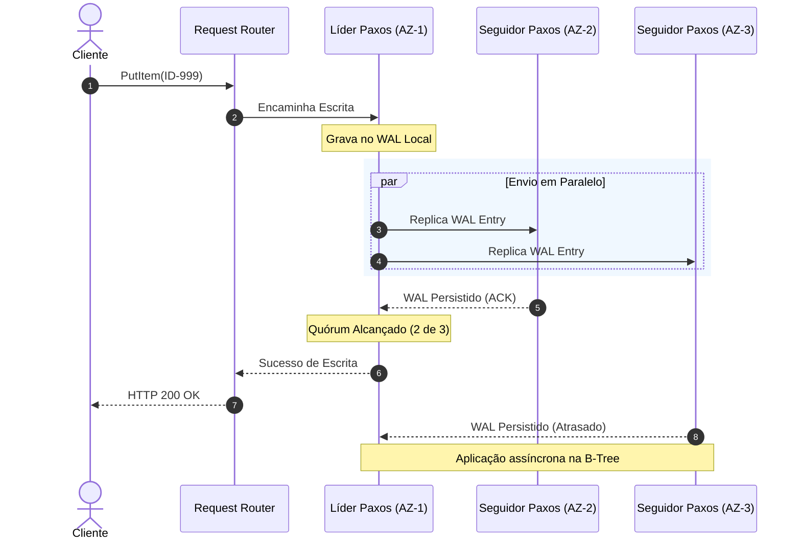
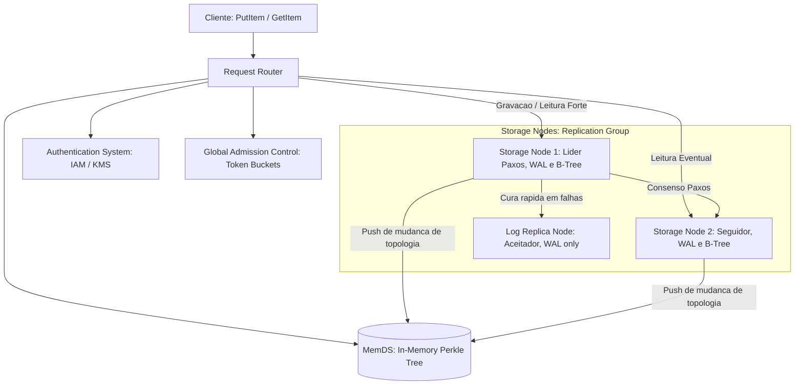

## 1. O que é o DynamoDB e que Problema Ele Resolve? (O Essencial para Iniciantes)

Para quem nunca usou o DynamoDB, a forma mais fácil de entendê-lo é como uma planilha de dados infinitamente escalável, serverless e totalmente gerenciada pela AWS.

*   **O Problema dos Bancos Tradicionais (SQL):** Em bancos de dados tradicionais, a escalabilidade horizontal exige esforço hercúleo: o engenheiro precisa gerenciar manualmente o particionamento dos servidores (*sharding*), planejar o hardware, atualizar patches de sistema operacional, configurar replicação master-slave e gerenciar conexões de rede concorrentes. Sob picos de tráfego extremos, o banco de dados costuma ser o gargalo que derruba a aplicação.
*   **O que o DynamoDB faz:** Ele remove toda a complexidade operacional da infraestrutura. O desenvolvedor apenas cria uma tabela por API e escreve dados, sem se preocupar com servidores, clusters ou provisionamento físico. O sistema cresce e diminui de forma elástica e transparente.
*   **A Promessa:** Latência consistente de dígito único de milissegundo (menos de 10ms) para qualquer volume de dados (de gigabytes a petabytes) e qualquer quantidade de acessos simultâneos (dezenas a milhões de requisições por segundo).
*   **NoSQL com ACID:** Diferente de outros bancos NoSQL primitivos que abrem mão de consistência forte em favor de velocidade, o DynamoDB oferece suporte completo a transações ACID (atômicas, consistentes, isoladas e duráveis) de nível *serializável*, sem comprometer sua escalabilidade horizontal.

---

## 2. O Modelo de Dados e Armazenamento (A Base)

Toda tabela no DynamoDB é composta por itens (linhas), e cada item é um conjunto de atributos (colunas) sem esquema fixo (*schema-less*). A estrutura física baseia-se na Chave Primária (*Primary Key*).

### A Chave Primária (The Primary Key)
Ela é definida obrigatoriamente na criação da tabela e determina a distribuição física dos dados:

1.  **Partition Key (Chave Simples):** Composta por um único atributo. O valor desse atributo é passado por uma **função de espalhamento (internal hash function)**. O resultado desse hash dita exatamente qual partição física (nó de armazenamento) guardará aquele item.
2.  **Composite Primary Key (Partition Key + Sort Key):** Composta por dois atributos. O primeiro (*Partition Key*) direciona o item à partição física via hash, e o segundo (*Sort Key*) é usado para agrupar e ordenar os dados fisicamente dentro daquela partição.

> 🛒 **Exemplo Prático (A Loja Eletrônica):**
> Se criarmos uma tabela de `Produtos` com chave simples `ProductID`:
> - Gravar o produto `Notebook Gamer` (ID `ID-999`) faz a string `"ID-999"` passar pelo hash (ex: `MD5("ID-999")`), apontando direto para a **Partição 3**.
>
> Se criarmos uma tabela de `Pedidos` com chave composta: `ClienteID` (Partition Key) e `DataPedido` (Sort Key):
> - O cliente `"Cliente-A"` faz duas compras em datas distintas. Ambos os pedidos caem na **mesma partição física** (pois o hash de `"Cliente-A"` é idêntico), mas estarão gravados ordenados lado a lado cronologicamente no SSD pela Sort Key.

---

## 3. Indexação Secundária: Consultas Rápidas sem SQL JOINs (LSI vs. GSI)

No mundo NoSQL, para obtermos alta performance sob escala massiva, **evitamos JOINs a todo custo**. Em vez disso, abraçamos a desnormalização e a duplicação de dados, modelando as tabelas de acordo com o padrão de acesso (*access patterns*) da aplicação. Para consultar os dados por atributos diferentes da chave primária principal, o DynamoDB fornece dois tipos de índices:

*   **Local Secondary Index (LSI):** 
    *   **Como funciona:** Utiliza a **mesma** *Partition Key* da tabela original, mas uma *Sort Key* diferente.
    *   **Arquitetura física:** É armazenado fisicamente **dentro da mesma partição lógica** onde reside o item principal.
    *   **Consistência:** Por compartilhar a mesma partição física, suporta **consistência forte** (*strongly consistent*) nas leituras de forma nativa.
*   **Global Secondary Index (GSI):**
    *   **Como funciona:** Pode ter uma *Partition Key* e uma *Sort Key* completamente diferentes da tabela original.
    *   **Arquitetura física:** Funciona como uma tabela secundária oculta e paralela. Quando um dardo é gravado na tabela principal, as mutações são enviadas assincronamente para a partição física do GSI.
    *   **Consistência:** Por ser atualizado assincronamente em background, as leituras no GSI são **eventualmente consistentes** (*eventually consistent*).

---

## 4. Captura de Mutações com DynamoDB Streams

O DynamoDB Streams é uma solução integrada de **Change Data Capture (CDC)** que grava todas as modificações de dados ocorridas em uma tabela em tempo real.

*   **O Fluxo de Eventos:** Qualquer inserção (`INSERT`), modificação (`MODIFY`) ou exclusão (`REMOVE`) gera um evento ordenado no stream.
*   **Aplicações Práticas em System Design:**
    *   **Arquiteturas orientadas a eventos:** Disparar funções serverless (como AWS Lambda) imediatamente após um dado ser alterado.
    *   **Sincronização externa:** Sincronizar dados em tempo real com mecanismos de busca (como OpenSearch) ou lagos de dados (S3).
    *   **Atualização de GSIs:** O próprio DynamoDB consome internamente os streams da tabela de forma transparente para atualizar os Índices Globais Secundários (GSIs).

---

## 5. Partições e Escalabilidade Horizontal (Partitioning)

Uma **partição** no DynamoDB é uma unidade de armazenamento lógica e física isolada (um bloco de disco SSD operando em um servidor físico) que gerencia uma faixa contígua do conjunto de chaves da tabela.

*   **Elasticidade Automática:** Conforme sua tabela acumula mais dados (uma partição física suporta limites de tamanho de armazenamento) ou exige mais poder de processamento, o DynamoDB divide essa partição em subpartições e as redistribui fisicamente pelo cluster de forma transparente.
*   **O Roteador de Requisições (Request Router):** Atua como o guarda de trânsito. Quando a requisição do cliente bate nele, o roteador calcula o hash da Partition Key e encaminha o tráfego de forma direta e instantânea ao nó físico correto.

---

## 6. Garantindo Alta Escrita (Multi-Paxos, WAL e Quórum)

Para alta disponibilidade e durabilidade, cada partição da tabela possui **três réplicas** físicas hospedadas em Zonas de Disponibilidade (Availability Zones - AZs) distintas.

Essas três réplicas formam um grupo coordenado pelo protocolo de consenso **Multi-Paxos**, que elege uma delas como a **Líder** (*Leader*) e as demais como **Seguidoras** (*Followers*).

### O Fluxo da Gravação:
1.  **Apenas o líder** do grupo Paxos aceita solicitações de escrita.
2.  Quando você grava seu `Notebook Gamer` via `PutItem`, o líder recebe a escrita, gera um registro em formato sequencial de log rápido chamado **Write-Ahead Log (WAL)** e o envia imediatamente aos seguidores.
3.  **O Quórum de Escrita:** O líder **não** espera que as três réplicas atualizem a árvore B-Tree final de dados no disco. A gravação é considerada concluída e confirmada como sucesso para a aplicação cliente assim que um **quórum mínimo de 2 das 3 réplicas** persistir de forma segura o registro no WAL local.
4.  A escrita sequencial no WAL é uma operação de I/O em disco extremamente leve, garantindo latências de gravação na casa de milissegundos de dígito único.

---

## 7. Consistência na Leitura (Eventually vs. Strongly Consistent)

O DynamoDB permite que o desenvolvedor ajuste o balanço entre performance e consistência ao ler os dados:

*   **Strongly Consistent Read (Leitura Fortemente Consistente):** O roteador direciona a chamada **obrigatoriamente ao líder** do grupo Paxos. Como o líder gerencia todas as atualizações, você tem garantia absoluta de ler a escrita mais recente. Isso concentra o tráfego no nó líder.
*   **Eventually Consistent Read (Leitura Eventualmente Consistente - Padrão):** O roteador distribui as requisições de leitura por **qualquer uma das três réplicas** de forma balanceada.
    *   **O Risco:** Se um seguidor ainda estiver processando o log WAL enviado pelo líder, o cliente poderá receber um dado levemente atrasado (por milissegundos).
    *   **O Ganho:** Remove gargalos do nó líder, dobra o throughput de leitura utilizável e reduz drasticamente a latência de resposta.

---

## 8. Arquitetura de Roteamento Avançada e Resiliência (MemDS)

O mapeamento entre chaves primárias e nós de armazenamento (*routing metadata*) é o componente mais crítico de latência do sistema. Para otimizá-lo, a Amazon implementou o **MemDS (In-Memory Datastore)** e um sistema de cache inteligente nos Request Routers que soluciona os desafios clássicos de concorrência e indisponibilidade.

### Como o MemDS se mantém sempre atualizado?
O fluxo de atualização de metadados do MemDS baseia-se em um modelo misto extremamente resiliente de notificações push e autocorreção sob demanda:
1.  **Atualizações baseadas em Push (Storage Nodes):** Os nós de armazenamento físicos são as fontes autoritativas da associação de partição. Toda vez que ocorre uma mudança de topologia (como uma partição dividida pelo *Split for Consumption* ou a migração automática de réplicas com falha pelo *autoadmin*), os **Storage Nodes empurram as updates de membership diretamente para o MemDS**. O MemDS então propaga esses dados de forma incremental para todos os seus nós.
2.  **Mecanismo de Autocorreção sob Demanda (Stale Metadata Mitigation):** Caso ocorra um atraso de propagação e o MemDS sirva uma rota desatualizada (*stale*) para o roteador, o sistema autocorrige-se em tempo de execução:
    - O Request Router direciona a requisição do cliente para o Storage Node incorreto.
    - O Storage Node percebe que aquela chave não está no intervalo sob sua custódia e rejeita a operação.
    - O Storage Node responde com o novo endereço da partição (se souber) ou com um código de erro específico.
    - O código de erro força o Request Router a ignorar seu cache local e a realizar uma consulta fresca e imediata ao MemDS para obter as rotas atualizadas.

### Resiliência contra Queda de Roteadores (Thundering Herd e Tempestade de Requisições)
A queda de instâncias de roteadores ou sua escalabilidade abrupta costuma derrubar bancos de dados tradicionais de metadados devido ao "cold start" (quando todos os novos caches iniciam zerados ao mesmo tempo). O DynamoDB resolveu esse problema usando duas frentes de projeto:

1.  **MemDS Redimensionado para 100% da Carga:** O MemDS não é um gargalo centralizado e frágil. Ele é um banco em memória distribuído horizontalmente que retém todos os dados altamente compactados em árvores lógicas do tipo **Perkle** (Patricia + Merkle Tree). A infraestrutura do MemDS foi projetada e dimensionada para **suportar nativamente até 100% da carga total de requisições do DynamoDB diretamente na memória RAM**, garantindo que mesmo se a taxa de acerto de cache dos roteadores caísse para zero por completo, a frota de MemDS continuaria servindo as chaves com latências de milissegundo de dígito único sem sofrer sobrecarga ou degradação.
2.  **O Truque do Tráfego Constante (Asynchronous Refresh):** Para impedir comportamentos bimodais extremos (sem tráfego quando o cache está cheio vs. picos colossais na perda do cache), os roteadores implementam a política de *Asynchronous Refresh*:
    - Quando ocorre um acerto de cache (*cache hit*), o Request Router atende ao cliente na hora.
    - Em background, de forma assíncrona, ele envia uma requisição para o MemDS para renovar e estender a vida útil daquela rota no cache local.
    - **A sacada técnica:** Como as chamadas em background ocorrem continuamente a cada leitura, o MemDS experimenta um volume de tráfego plano e perfeitamente constante. Quando um roteador cai e é reiniciado, **não ocorre nenhuma variação drástica ou bimodal no perfil de rede que bate no MemDS**. A engenharia abriu mão da eficiência pura (desperdiçando certa banda em background) para obter uma **previsibilidade total sob estresse**, blindando todo o ecossistema contra falhas em cascata.

---

## 9. Resumo da Evolução: Gargalo vs. Solução Técnica

Com as bases estabelecidas, agora fica muito mais simples entender por que a Amazon precisou evoluir cada componente sob escala massiva:

| Componente | Missão Principal | Primeiro Gargalo (Escala) | Solução de Engenharia |
| :--- | :--- | :--- | :--- |
| **Request Router (Cache)** | Descobrir a rota física (Storage Node) a partir da chave primária. | **Bimodalidade e Cold Starts:** Baixava o mapa de partições inteiro de tabelas gigantes. Quedas ou reinicializações geravam picos de 75% no serviço de metadados. | **MemDS & Async Refresh:** Criação de um banco em memória distribuído com árvore **Perkle**. Os caches dos roteadores agora se atualizam assincronamente a cada *cache hit*, mantendo a carga plana. |
| **Admission Control** | Verificar se o lojista possui saldo de throughput contratado (tokens). | **Partições Quentes & Throughput Dilution:** Throughput dividido estaticamente entre partições. Picos de acessos concentrados geravam rejeição (*throttling*) indevida. | **Global Admission Control (GAC):** Substituição do controle local por contadores globais distribuídos (via token buckets em memória). Permite que partições consumam até a cota total da tabela. |
| **Storage Nodes (Healing)** | Gravar o WAL sequencial e estruturar os dados na B-Tree física. | **Lentidão na Recuperação de Nós:** Reconstruir um nó físico do zero exigia copiar toda a B-Tree de dados pela rede, levando minutos e deixando o quórum vulnerável. | **Log Replicas:** Criação de nós Paxos efêmeros que copiam apenas logs de transações (`WAL`) recentes. Entram online em segundos para restabelecer o quórum seguro. |
| **Consensus (Paxos)** | Garantir concordância do estado do banco entre as réplicas. | **Eleições Espúrias de Líder:** Falhas cinzas de rede (*gray failures*) isolavam parcialmente nós seguidores, que assumiam falsamente a queda do líder e travavam o sistema. | **Pre-vote Protocol:** Antes de iniciar eleição, o nó seguidor precisa de validação dos outros nós para confirmar se o líder caiu de fato. |

---

## 10. A Filosofia Amazon: "Boring Systems" e Baixa Variância

Uma das principais lições culturais e técnicas da AWS no design do DynamoDB é a **busca deliberada por previsibilidade sobre eficiência bruta**.

*   **O Mal da Variabilidade:** Para a Amazon, um sistema que responde às vezes em 10ms, às vezes em 3s, e às vezes em 500ms é muito pior e mais nocivo para a experiência do usuário do que um sistema que responde consistentemente em 100ms. 
*   **O Efeito Cascata:** Em arquiteturas de microsserviços complexos, picos isolados de latência (outliers, medidos no percentil P99) em um serviço base como o DynamoDB propagam-se pelas camadas superiores da aplicação (*cascade effect*), gerando filas de conexão e degradando a experiência como um todo.
*   **O Preço da Previsibilidade:** O DynamoDB prefere realizar tarefas redundantes ou "desperdiçar" processamento (como o *Asynchronous Refresh* constante do cache de rotas e o sobredimensionamento do MemDS) se isso garantir que o sistema se comporte de forma uniforme, entediante e imune a choques térmicos de tráfego.

---

## 11. Principais Aprendizados para System Design

1.  **Evite a Bimodalidade (Predictability over Efficiency):** Projetar sistemas para se comportarem da mesma forma em situações de pico ou de normalidade evita colapsos imprevisíveis. O refresco assíncrono do cache no DynamoDB consome mais recursos, mas blinda o banco de metadados contra *cold starts* catastróficos.
2.  **Separe a Lógica Física da Lógica de Negócios:** Amarrar alocação de capacidade ao particionamento físico gera restrições indesejadas. O controle global descentralizado (GAC) abstrai essa limitação física de forma transparente para o cliente.
3.  **Reduza o Tempo de Recuperação (MTTR):** Reduzir o tempo de recuperação é mais eficiente para a durabilidade do que tentar evitar 100% das falhas físicas. Com `Log Replicas`, o DynamoDB restabelece seu quórum Paxos de segurança em segundos, e não minutos.
