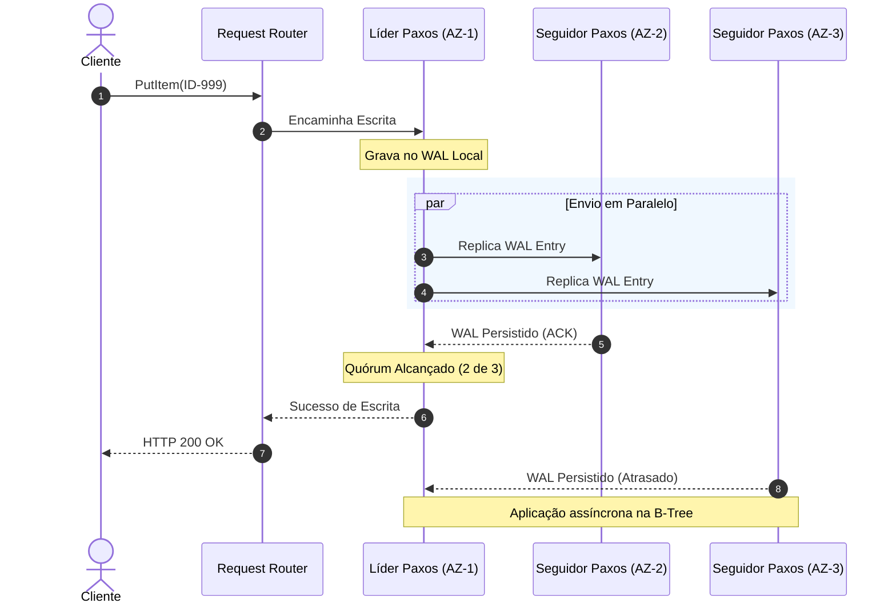
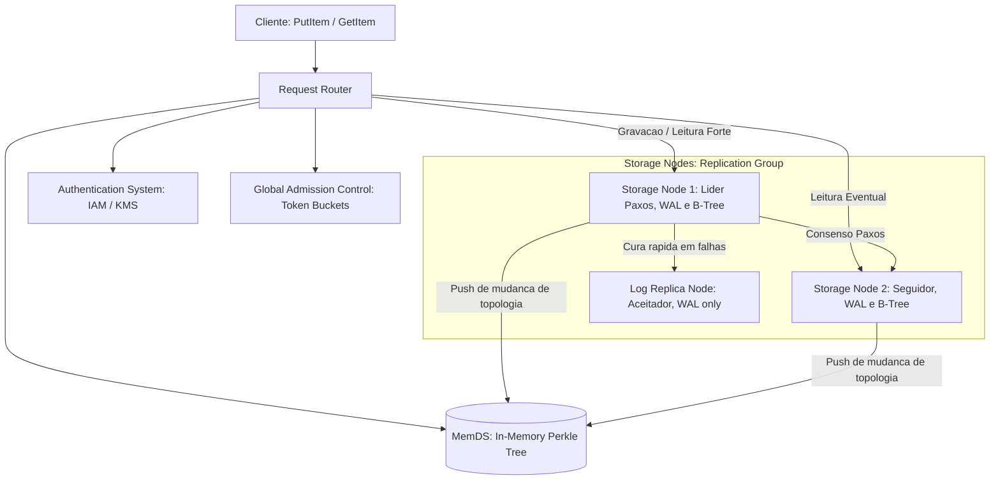

## 1. O Modelo de Dados e Armazenamento (A Base)

Para entender o DynamoDB, precisamos começar de onde os dados realmente vivem e como eles são estruturados logicamente antes de entrarmos nos microsserviços complexos.

### A Chave Primária (The Primary Key)
Toda tabela no DynamoDB exige uma chave primária definida no momento de sua criação. Ela identifica unicamente cada registro (item) da tabela. Existem dois tipos de chaves primárias:

1.  **Partition Key (Simple Primary Key):** Composta por um único atributo. O valor desse atributo é passado por uma **função de espalhamento (internal hash function)**. O resultado desse hash determina o local físico (a partição) onde o item será armazenado.
2.  **Composite Primary Key (Partition Key + Sort Key):** Composta por dois atributos. O primeiro é a *Partition Key* (passada pelo hash para achar a partição) e o segundo é a *Sort Key*. Sob esse modelo, múltiplos itens podem compartilhar a **mesma** *Partition Key*, desde que possuam *Sort Keys* **diferentes**. O DynamoDB agrupa fisicamente esses itens dentro da partição e os mantém ordenados pela *Sort Key*.

> 🛒 **Exemplo Prático (A Loja Eletrônica):**
> Se você criar uma tabela de `Produtos` com uma chave simples sendo o `ProductID`:
> - Gravar o produto `Notebook Gamer` (ID `ID-999`) fará com que a string `"ID-999"` passe pela função de hash (ex: `MD5("ID-999") = 0x7a4f...`). Esse hash aponta diretamente para a **Partição 3**.
>
> Se você criar uma tabela de `Pedidos` com uma chave composta: `ClienteID` (Partition Key) e `DataPedido` (Sort Key):
> - O cliente `"Cliente-A"` faz duas compras em datas diferentes. Ambos os pedidos serão armazenados na **mesma partição física** (porque o hash de `"Cliente-A"` é idêntico), mas estarão ordenados lado a lado cronologicamente pela data.

---

## 2. O que é uma Partição (Partition) e como ela Escala?

Uma **partição** no DynamoDB é uma unidade lógica e física de armazenamento que gerencia uma faixa específica e contígua do conjunto de chaves da tabela.

*   **Boundless Scale (Escala Sem Limites):** No início, uma tabela pode ter apenas uma partição. Conforme o volume de dados cresce ou o tráfego aumenta, o DynamoDB divide essa tabela em múltiplas partições. Cada partição gerencia um subconjunto ordenado e disjunto do mapa de chaves (Key Range).
*   **O Mecanismo de Roteamento:** Os roteadores de requisição (*Request Routers*) usam o hash da sua *Partition Key* para identificar em qual intervalo de partição aquele dado se encaixa.

---

## 3. Garantindo Alta Escrita (Multi-Paxos e Quórum de Escrita)

Para que o DynamoDB ofereça alta disponibilidade e durabilidade, ele não armazena sua partição em apenas uma máquina física. Cada partição possui **três réplicas** distribuídas em diferentes Zonas de Disponibilidade (Availability Zones - AZs).

Essas três réplicas formam um **Replication Group (Grupo de Replicação)** que utiliza o protocolo de consenso **Multi-Paxos** para eleger um líder.

### O Fluxo da Gravação de Alta Performance:
1.  **Apenas o líder** do grupo Paxos pode aceitar solicitações de escrita.
2.  Quando você grava seu `Notebook Gamer` via `PutItem`, o líder recebe a escrita, gera um registro em formato sequencial de log chamado **Write-Ahead Log (WAL)** e o envia imediatamente aos seus seguidores.
3.  **O Quórum de Escrita (Write Quorum):** O líder **não** espera que todas as 3 réplicas salvem o dado na árvore B-Tree final. A escrita é considerada um sucesso e confirmada de volta para você assim que um **quórum de 2 das 3 réplicas** persistir de forma segura o registro de log nos seus respectivos WALs locais.
4.  Como a escrita de log sequencial no WAL é uma operação de disco extremamente simples e rápida (I/O sequencial), a latência de escrita permanece na casa de **dígito único de milissegundos**.

---

## 4. Leitura Eventualmente Consistente (Eventually Consistent Reads) vs. Leitura Forte

O DynamoDB oferece flexibilidade ao desenvolvedor no momento de ler os dados:

*   **Strongly Consistent Read (Leitura Fortemente Consistente):** É direcionada **obrigatoriamente ao líder** da partição. Como o líder é a autoridade máxima de consenso e gerencia as escritas, ele garante que você lerá a versionamento mais recente e atualizado do produto.
*   **Eventually Consistent Read (Leitura Eventualmente Consistente):** Pode ser servida por **qualquer uma das três réplicas** do grupo de replicação. 
    *   **Como isso funciona?** Se a réplica na AZ-3 ainda estiver processando assincronamente os logs do WAL que o líder enviou, ela pode responder ao seu request de leitura com um dado ligeiramente antigo (atraso de milissegundos).
    *   **O Ganho de System Design:** Ao aceitar a consistência eventual, você **desafoga o nó líder**. O tráfego de leitura é distribuído entre as réplicas, aumentando massivamente a vazão do sistema (*throughput*) e reduzindo as latências de leitura.

---

## 5. Arquitetura de Roteamento Avançada e Resiliência (MemDS)

O mapeamento entre chaves primárias e nós de armazenamento (*routing metadata*) é o componente mais crítico de latência do sistema. Para otimizá-lo, a Amazon implementou o **MemDS (In-Memory Datastore)** e um sistema de cache inteligente nos Request Routers que soluciona os desafios clássicos de concorrência e indisponibilidade.

### Como o MemDS se mantém sempre atualizado?
O fluxo de atualização de metadados do MemDS baseia-se em um modelo misto extremamente resiliente de notificações push e autocorreção sob demanda:
1.  **Atualizações baseadas em Push (Storage Nodes):** Os nós de armazenamento físicos são as fontes autoritativas da associação de partição. Toda vez que ocorre uma mudança de topologia (como uma partição dividida pelo *Split for Consumption* ou a migração automática de réplicas com falha pelo *autoadmin*), os **Storage Nodes empurram as atualizações de membership diretamente para o MemDS**. O MemDS então propaga esses dados de forma incremental para todos os seus nós.
2.  **Mecanismo de Autocorreção sob Demanda (Stale Metadata Mitigation):** Caso ocorra um atraso de propagação e o MemDS sirva uma rota desatualizada (*stale*) para o roteador, o sistema autocorrige-se em tempo de execução:
    - O Request Router direciona a requisição do cliente para o Storage Node incorreto.
    - O Storage Node percebe que aquela chave não está no intervalo sob sua custódia e rejeita a operação.
    - O Storage Node responde com o novo endereço da partição (se souber) ou com um código de erro específico.
    - O código de erro força o Request Router a ignorar seu cache local e a realizar uma consulta fresca e imediata ao MemDS para obter as rotas atualizadas.

### Resiliência contra Queda de Roteadores (Thundering Herd e Tempestade de Requisições)
A queda de instâncias de roteadores ou sua escalabilidade abrupta costuma derrubar bancos de dados tradicionais de metadados devido ao "cold start" (quando todos os novos caches iniciam zerados ao mesmo tempo). O DynamoDB resolveu esse problema usando duas frentes de projeto:

1.  **MemDS Redimensionado para 100% da Carga:** O MemDS não é um gargalo centralizado e frágil. Ele é um banco em memória distribuído horizontalmente que retém todos os dados altamente compactados em árvores lógicas do tipo **Perkle** (Patricia + Merkle Tree). A infraestrutura do MemDS foi projetada e dimensionada para **suportar nativamente até 100% da carga total de requisições do DynamoDB diretamente na memória RAM**, garantindo que mesmo se a taxa de acerto de cache dos roteadores caísse para zero por completo, a frota de MemDS continuaria servindo as chaves com latências de milissegundo de dígito único sem sofrer sobrecarga ou degradação.
2.  **O Truque do Tráfego Constante (Asynchronous Refresh):** Para impedir comportamentos bimodais extremos (sem tráfego quando o cache está cheio vs. picos colossais na perda do cache), os roteadores implementam a política de *Asynchronous Refresh*:
    - Quando ocorre um acerto de cache (*cache hit*), o Request Router atende ao cliente na hora.
    - Em background, de forma assíncrona, ele envia uma requisição para o MemDS para renovar e estender a vida útil daquela rota no cache local.
    - **A sacada técnica:** Como as chamadas em background ocorrem continuamente a cada leitura, o MemDS experimenta um volume de tráfego plano e perfeitamente constante. Quando um roteador cai e é reiniciado, **não ocorre nenhuma variação drástica ou bimodal no perfil de rede que bate no MemDS**. A engenharia abriu mão da eficiência pura (desperdiçando certa banda em background) para obter uma **previsibilidade total sob estresse**, blindando todo o ecossistema contra falhas em cascata.

---

## 6. Resumo da Evolução: Gargalo vs. Solução Técnica

Com as bases estabelecidas, agora fica muito mais simples entender por que a Amazon precisou evoluir cada componente sob escala massiva:

| Componente | Missão Principal | Primeiro Gargalo (Escala) | Solução de Engenharia |
| :--- | :--- | :--- | :--- |
| **Request Router (Cache)** | Descobrir a rota física (Storage Node) a partir da chave primária. | **Bimodalidade e Cold Starts:** Baixava o mapa de partições inteiro de tabelas gigantes. Quedas ou reinicializações geravam picos de 75% no serviço de metadados. | **MemDS & Async Refresh:** Criação de um banco em memória distribuído com árvore **Perkle**. Os caches dos roteadores agora se atualizam assincronamente a cada *cache hit*, mantendo a carga plana. |
| **Admission Control** | Verificar se o lojista possui saldo de throughput contratado (tokens). | **Partições Quentes & Throughput Dilution:** Throughput dividido estaticamente entre partições. Picos de acessos concentrados geravam rejeição (*throttling*) indevida. | **Global Admission Control (GAC):** Substituição do controle local por contadores globais distribuídos (via token buckets em memória). Permite que partições consumam até a cota total da tabela. |
| **Storage Nodes (Healing)** | Gravar o WAL sequencial e estruturar os dados na B-Tree física. | **Lentidão na Recuperação de Nós:** Reconstruir um nó físico do zero exigia copiar toda a B-Tree de dados pela rede, levando minutos e deixando o quórum vulnerável. | **Log Replicas:** Criação de nós Paxos efêmeros que copiam apenas logs de transações (`WAL`) recentes. Entram online em segundos para restabelecer o quórum seguro. |
| **Consensus (Paxos)** | Garantir concordância do estado do banco entre as réplicas. | **Eleições Espúrias de Líder:** Falhas cinzas de rede (*gray failures*) isolavam parcialmente nós seguidores, que assumiam falsamente a queda do líder e travavam o sistema. | **Pre-vote Protocol:** Antes de iniciar eleição, o nó seguidor precisa de validação dos outros nós para confirmar se o líder caiu de fato. |

---

## 7. Principais Aprendizados para System Design

1.  **Evite a Bimodalidade (Predictability over Efficiency):** Projetar sistemas para se comportarem da mesma forma em situações de pico ou de normalidade evita colapsos imprevisíveis. O refresco assíncrono do cache no DynamoDB consome mais recursos, mas blinda o banco de metadados contra *cold starts* catastróficos.
2.  **Separe a Lógica Física da Lógica de Negócios:** Amarrar alocação de capacidade ao particionamento físico gera restrições indesejadas. O controle global descentralizado (GAC) abstrai essa limitação física de forma transparente para o cliente.
3.  **Reduza o Tempo de Recuperação (MTTR):** Reduzir o tempo de recuperação é mais eficiente para a durabilidade do que tentar evitar 100% das falhas físicas. Com `Log Replicas`, o DynamoDB restabelece seu quórum Paxos de segurança em segundos, e não minutos.
