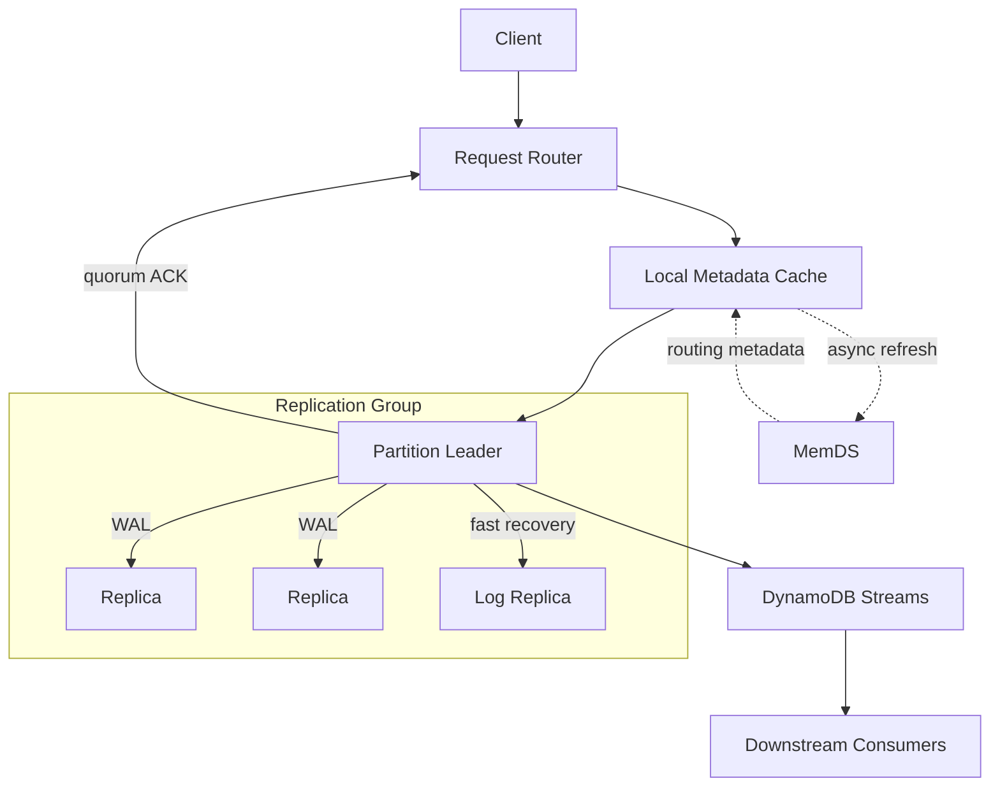

## 🎯 Highlights & Principais Aprendizados

* **Previsibilidade acima da eficiência máxima:** O DynamoDB aceita trabalho redundante para evitar mudanças bruscas de comportamento justamente durante falhas.
* **Particionamento resolve volume, mas não hot keys:** Hashing distribui chaves; uma única chave muito acessada ainda pode concentrar tráfego.
* **Cache não pode ser requisito de sobrevivência:** O backend de metadata precisa suportar a carga mesmo quando os caches dos routers desaparecem.
* **Replicação exige consenso:** Multi-Paxos, WAL e quorum majoritário permitem confirmar writes com durabilidade sem depender de todas as réplicas.
* **Recuperar quorum vem antes de reconstruir tudo:** Log Replicas restauram rapidamente a participação no consenso; a cópia completa dos dados pode vir depois.
* **Falhas parciais precisam de cautela:** Pre-vote evita que uma observação local equivocada dispare eleições desnecessárias.

> **Predictability over maximum efficiency.**

---

## 🛠️ Problemas Resolvidos & Soluções de System Design

### 1. Dados Maiores que Uma Máquina

* **Problema:** Uma tabela deixa de caber ou de atender o volume de tráfego em um único node.
* **Solução:** A `Partition Key` passa por uma função de hash que determina a partition responsável. A `Sort Key`, quando existe, organiza os itens dentro da mesma Partition Key.

### 2. Descoberta da Partition Física

* **Problema:** Partitions sofrem splits, migrações, troca de leader e substituição de réplicas. O router precisa saber onde cada partition está agora.
* **Solução:** Request Routers consultam routing metadata e mantêm um cache local para retirar o lookup remoto do hot path.

### 3. Cold Cache e Thundering Herd

* **Problema:** Reiniciar milhares de routers esvazia os caches e pode produzir uma avalanche no metadata service quando o sistema já está sob estresse.
* **Solução:** O **MemDS** é dimensionado para sustentar a carga mesmo sem os caches. Os routers fazem **async refresh** inclusive em cache hits, mantendo o backend continuamente exercitado e reduzindo o comportamento bimodal.

### 4. Metadata Grande ou Temporariamente Stale

* **Problema:** O mapa global de partitions é enorme e os caches não ficam perfeitamente sincronizados durante mudanças de topologia.
* **Solução:** O MemDS usa **Perkle Trees**, combinando compactação de prefixos das Patricia Trees com comparação incremental por hashes das Merkle Trees. Quando metadata stale envia uma request ao node errado, o erro é detectado, o cache é atualizado e a request é repetida.

### 5. Falha de Storage Nodes

* **Problema:** Uma partition não pode depender de uma única máquina.
* **Solução:** Cada partition possui réplicas distribuídas entre Availability Zones. Um grupo de **Multi-Paxos** coordena as writes, e um quorum majoritário permite progresso mesmo com uma réplica indisponível.

### 6. Durabilidade sem Materialização Imediata

* **Problema:** Atualizar toda a estrutura de armazenamento antes do ACK aumentaria a latência das writes.
* **Solução:** A mudança é persistida primeiro no **Write-Ahead Log (WAL)** e replicada para o quorum. A materialização completa pode ocorrer depois.

### 7. Garantias Diferentes de Leitura

* **Problema:** Nem toda leitura precisa pagar o mesmo custo de consistência.
* **Solução:** Strongly Consistent Reads passam pelo caminho autoritativo do replication group; Eventually Consistent Reads podem usar uma réplica com pequeno replication lag em troca de maior flexibilidade e throughput.

### 8. Hot Partitions e Capacidade Fragmentada

* **Problema:** Hash distribui keys, não requests. Uma partition pode ficar quente enquanto a capacidade de outras permanece ociosa.
* **Solução:** **Split for Consumption** divide partitions de acordo com o tráfego. O **Global Admission Control** separa a capacidade lógica da tabela do layout físico, reduzindo throughput dilution. Uma hot key isolada, porém, ainda exige uma boa modelagem da Partition Key.

### 9. Recuperação Lenta de Réplicas

* **Problema:** Copiar todo o dataset antes de restaurar uma réplica deixa o grupo vulnerável a uma segunda falha.
* **Solução:** Uma **Log Replica** participa rapidamente do consenso mantendo o replicated log. Primeiro o sistema recupera quorum e safety; depois reconstrói a réplica completa.

### 10. Gray Failures e Eleições Desnecessárias

* **Problema:** Um follower pode perder contato com o leader enquanto os demais peers continuam saudáveis e iniciar uma eleição indevida.
* **Solução:** O **pre-vote** consulta os peers antes da eleição. Uma observação local só vira decisão global quando o grupo confirma o problema.

### 11. Propagação de Mudanças

* **Problema:** Sistemas downstream precisam reagir a inserts, updates e deletes sem consultar continuamente a tabela.
* **Solução:** DynamoDB Streams expõe as alterações como um fluxo de CDC para Lambda, analytics, indexação e outros consumidores.

---

## Detalhes da Arquitetura

### Partition Key e Sort Key

A Partition Key define onde os dados ficam; a Sort Key organiza e permite consultar itens relacionados dentro da mesma partition. Distribuição uniforme de keys não implica distribuição uniforme de tráfego: uma key muito popular ainda produz uma hot partition.

### Quorum, WAL e Leituras

Em um replication group com três réplicas, um quorum de duas permite confirmar writes apesar da falha de um node. Quaisquer dois quorums majoritários possuem ao menos uma réplica em comum, preservando a continuidade do estado confirmado. O WAL separa durabilidade de materialização, enquanto as opções de leitura permitem escolher entre estado autoritativo e possível replication lag.

### MemDS e Async Refresh

O cache do router é uma otimização de latência, não um requisito para o backend sobreviver. O async refresh gera trabalho redundante durante a operação normal, mas evita que cache frio transforme uma falha em um perfil de carga completamente diferente. Metadata stale é tolerável porque pode ser detectado e corrigido com refresh e retry.

### Log Replicas e MTTR

Participar do consenso não exige possuir imediatamente todo o dataset. Ao restaurar primeiro o replicated log, o DynamoDB reduz o tempo em que o grupo opera sem redundância completa. A reconstrução dos dados ocorre depois, fora do caminho crítico para recuperar safety.

## Impacto dos Resultados

- **Escalabilidade:** Partitioning e splits permitem distribuir grandes volumes de dados e tráfego entre storage nodes.

- **Previsibilidade:** MemDS e async refresh evitam que a perda dos caches altere radicalmente o perfil de carga do sistema.

- **Disponibilidade:** Replicação, quorum, Log Replicas e pre-vote reduzem indisponibilidade e tempo de recuperação.

- **Flexibilidade:** Strong e eventual consistency permitem equilibrar garantias, latência e throughput por operação.

## Para Lembrar

- Partitioning escala dados, mas hashing não elimina hot keys.
- Quorum funciona pela interseção das maiorias.
- WAL separa durabilidade de materialização.
- Cache deve melhorar desempenho sem se tornar requisito de sobrevivência.
- Metadata stale pode ser aceitável quando é detectável e corrigível.
- Reduzir MTTR pode ser mais valioso do que tentar impedir toda falha.

> **A ideia central do DynamoDB não é um algoritmo específico, mas construir um sistema que continue previsível quando partes dele falham, escalam ou ficam quentes.**

## Referência

[Amazon DynamoDB: A Scalable, Predictably Performant, and Fully Managed NoSQL Database Service](https://www.usenix.org/system/files/atc22-elhemali.pdf) — USENIX ATC 2022

## Connections

- [[Cursos/Descomplicando System Design/CAP and Databases/Databases|Databases]]
- [[Cursos/Descomplicando System Design/CAP and Databases/Database Models Reference|Database Models Reference]]
- [[Cursos/Descomplicando System Design/Sharding/Sharding|Sharding]]
- [[Cursos/Descomplicando System Design/Concepts/Partition|Partition]]
- [[Cursos/Descomplicando System Design/Concepts/Consistency|Consistency]]
- [[Cursos/Descomplicando System Design/Concepts/Availability|Availability]]
- [[Cursos/Descomplicando System Design/Concepts/Durability|Durability]]
- [[Cursos/Descomplicando System Design/CAP and Databases/PACELC|PACELC]]
- [[Algoritmos e Estrutura de Dados/B-Trees|B-Trees]]
