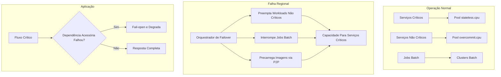

## 🎯 Highlights & Principais Aprendizados

* **Failover é produto de arquitetura, não só de capacidade:** A Uber reduziu a capacidade provisionada para failover de aproximadamente **2x para 1,3x** ao combinar isolamento de dependências, priorização de serviços e reaproveitamento controlado de recursos.
* **Fail-open protege fluxos críticos:** Serviços essenciais, como solicitar uma viagem, não podem depender rigidamente de serviços acessórios, como promoções. Dependências não críticas precisam degradar sem bloquear o caminho principal.
* **Overcommit seguro exige classes de workload:** Recursos reservados para serviços críticos podem ser usados por workloads não críticos em tempo normal, desde que o scheduler consiga expulsá-los rapidamente durante uma falha.
* **Batch vira reserva elástica:** Clusters de processamento offline podem ser temporariamente convertidos em capacidade para microserviços, porque jobs analíticos toleram interrupção melhor que tráfego transacional.
* **Imagem Docker também é gargalo de failover:** Em migrações massivas, puxar imagens ao mesmo tempo cria efeito manada. Preload e distribuição P2P reduzem o tempo de recuperação.
* **Drills em produção são parte da arquitetura:** A confiabilidade veio de testes recorrentes, não de documentação estática. Os drills expuseram milhares de dependências inseguras antes de uma crise real.

---

## 🛠️ Problemas Resolvidos & Soluções de System Design

### 1. Dependências Não Críticas Bloqueando Fluxos Críticos
* **Problema:** Serviços críticos dependiam de serviços acessórios. Se uma dependência como promoções falhasse, o fluxo principal podia travar por comportamento **fail-close**.
* **Solução:** A Uber identificou dependências perigosas com análise estática e telemetria em produção, depois adaptou clientes e chamadas para permitir **fail-open** quando a dependência não era essencial.

### 2. Capacidade de Failover Ociosa
* **Problema:** Reservar máquinas inteiras para desastre mantinha capacidade parada a maior parte do tempo, reduzindo utilização de CPU e encarecendo a infraestrutura.
* **Solução:** Criação de pools com prioridades diferentes no Kubernetes, como `stateless.cpu` para serviços críticos e `overcommit.cpu` para workloads não críticos. Em tempo normal, serviços menos críticos usam a folga; em falha, são preemptados.

### 3. Falta de Capacidade Imediata Para Absorver Região Perdida
* **Problema:** Uma falha regional exige deslocar tráfego e workloads rapidamente, mas comprar ou manter capacidade dedicada para isso aumenta muito o custo.
* **Solução:** Uso de clusters de **batch** como reserva. Jobs analíticos e de IA são interrompidos temporariamente, liberando servidores para microserviços online em menos de dezenas de minutos.

### 4. Efeito Manada no Pull de Imagens
* **Problema:** Realocar milhares de serviços ao mesmo tempo faz muitos nós puxarem imagens Docker simultaneamente, saturando rede, registry e tempo de inicialização.
* **Solução:** Pré-carregamento e distribuição **peer-to-peer** das imagens antes ou durante a movimentação do tráfego, reduzindo o caminho crítico de startup.

### 5. Ausência de Priorização Entre Serviços
* **Problema:** Tratar todos os microserviços como igualmente importantes impede decisões automáticas durante uma crise. O sistema não sabe o que preservar, degradar ou desligar.
* **Solução:** Classificação explícita de criticidade e políticas automáticas de preempção. Serviços ligados ao fluxo principal recebem prioridade; serviços acessórios podem degradar, pausar ou perder capacidade.

### 6. Confiabilidade Não Testada Sob Pressão Real
* **Problema:** Sem simulações frequentes, dependências inseguras só aparecem durante incidentes reais, quando o custo é maior.
* **Solução:** Execução recorrente de drills em produção e staging. A Uber reporta dezenas de simulações e milhares de dependências inseguras encontradas e corrigidas.

---

## Impacto dos Resultados

- **Eficiência de capacidade:** Redução da capacidade reservada para failover de aproximadamente **2x para 1,3x**, com melhor utilização de CPU.

- **Resiliência de produto:** Serviços críticos continuam operando mesmo quando dependências não essenciais são desligadas ou degradadas.

- **Tempo de recuperação:** Uso de batch, preempção e preload de imagens reduz o tempo necessário para recolocar microserviços em capacidade disponível.

- **Maturidade operacional:** Drills recorrentes transformam failover em rotina testada, não em procedimento manual raro.

Source: https://arxiv.org/pdf/2603.07345
