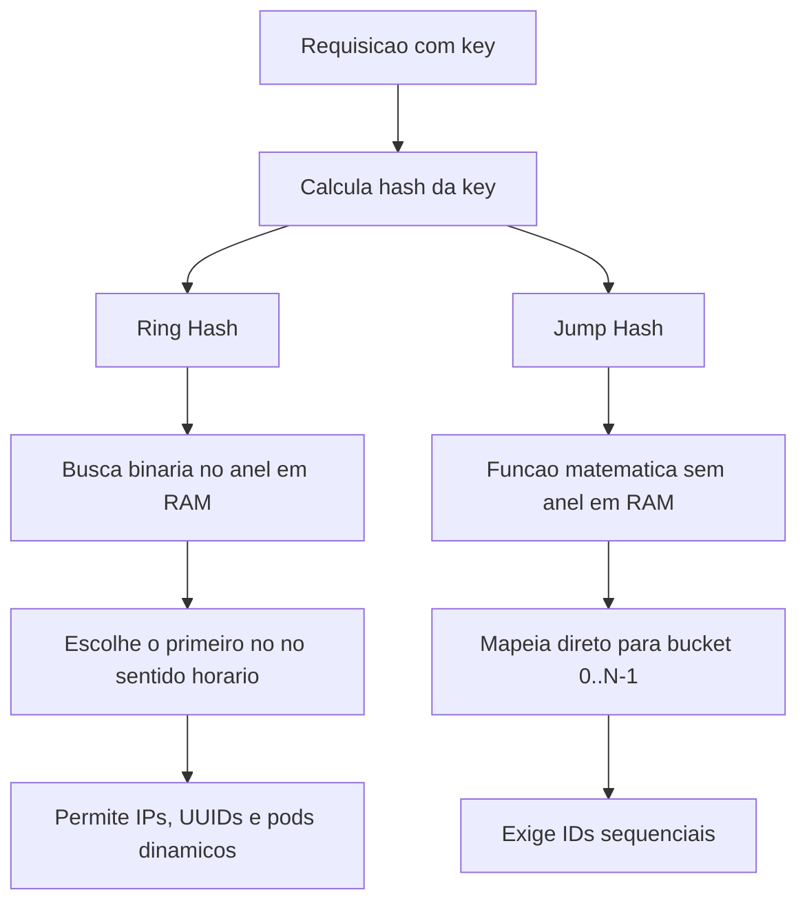

## 1. O Problema
Em sistemas distribuídos clássicos, a distribuição de dados ou tráfego entre $N$ servidores costuma começar com um cálculo de módulo:

$$
\text{Servidor} = \text{Hash}(\text{key}) \pmod N
$$

**O grande problema:** quando um nó entra ou sai do cluster ($N$ muda), **quase 100% das chaves são remapeadas** para novos nós. Isso destrói caches locais (*cache churn*), sobrecarrega bancos de dados subjacentes e pode derrubar o sistema em cascata.

Isso aparece diretamente em [[Sharding]], [[Algoritmos de balanceamento de carga]] e arquiteturas com cache local, como o resumo do artigo [[Zalando Client-Side Load Balancing at 1M reqs]].

---

## 2. A Solução do Hash Consistente
O hash consistente limita o remapeamento. Ao adicionar ou remover um nó, aproximadamente apenas $\frac{1}{N}$ das chaves muda de dono, mantendo o restante do sistema intacto.

### Conceitos-Chave

- **Hash Ring:** o espaço de saída da função de hash, por exemplo $0$ a $2^{64}-1$, é tratado como uma circunferência contínua. Tanto servidores quanto chaves recebem uma posição no anel.
- **Nós Virtuais (VNodes):** para evitar que nós físicos fiquem desproporcionalmente carregados (*hotspots*), cada servidor físico cria múltiplos pontos virtuais, por exemplo 100 VNodes, intercalados ao longo do anel.
- **Busca no sentido horário:** uma chave é atribuída ao primeiro VNode encontrado ao caminhar no sentido horário a partir da sua posição.
- **Busca binária:** o roteamento roda no processo fazendo busca binária no array ordenado de VNodes para encontrar o nó responsável em tempo $O(\log K)$.

---

## 3. Principais Algoritmos e Implementações

### A. Ring-Based Consistent Hash (Anel Clássico com VNodes)

- **Como funciona:** mapeia VNodes e chaves em um anel de $N$ bits de largura, normalmente 32 ou 64 bits.
- **Funções de hash comuns:** `xxHash64`, `MurmurHash3`.
- **Prós:** aceita qualquer identificador de nó, como IPs, UUIDs e pods [[Kubernetes]]; é tolerante a falhas no meio da topologia.
- **Contras:** requer memória para manter a estrutura do anel e os VNodes: $O(K)$.
- **Casos reais:** [[Zalando Client-Side Load Balancing at 1M reqs]], Apache Cassandra com `Murmur3Partitioner`, Memcached e roteamento de chaves em sistemas como [[AWS DynamoDB - How it Works]].

---

### B. Jump Consistent Hash (Google)

- **Como funciona:** algoritmo probabilístico e puramente matemático que calcula o bucket de destino diretamente para um intervalo de $0$ a $N-1$.
- **Prós:** consome **zero memória** para estrutura de anel e tem execução muito rápida.
- **Contras:** os servidores precisam ser numerados estritamente em sequência, como $0, 1, ..., N-1$. Não lida bem com falha ou remoção de nós no meio da sequência.
- **Casos reais:** sharding interno de alta performance e load balancers onde os servidores possuem IDs ordinais controlados, como `node-0`, `node-1`, `node-2`.

---

### C. Bounded-Load Consistent Hash (Google / HAProxy)

- **Como funciona:** variação do anel que impõe um limite máximo de carga (*cap*) para cada nó, por exemplo $1.25 \times \text{média}$. Se o nó responsável ultrapassa esse limite, a chave pula para o próximo nó disponível no anel.
- **Prós:** reduz *hotspots* quando uma chave, tenant ou item fica muito popular e sobrecarrega um nó específico.
- **Casos reais:** HAProxy, Vimeo/Skyfire e algoritmos de [[Load Balancing (Balanceamento de Carga)]] que precisam preservar localidade sem ignorar carga.

---

## 4. Matriz Comparativa de Algoritmos

| Algoritmo | Complexidade de Memória | Complexidade de Busca | Exige IDs Numéricos Sequenciais? | Suporta Nós Nativos do Kubernetes/IPs? |
| :--- | :--- | :--- | :--- | :--- |
| **Ring Hash (com VNodes)** | $O(K \cdot V)$ | $O(\log(K \cdot V))$ | Não | **Sim** |
| **Jump Hash** | **$O(1)$ (Zero)** | $O(\ln N)$ | **Sim** | Não |
| **Bounded-Load Ring** | $O(K \cdot V)$ | $O(\log(K \cdot V))$ | Não | **Sim** |

> **Legenda:** $N$ = número de servidores físicos; $K$ = total de instâncias; $V$ = número de VNodes por servidor.

---

## 5. Resumo Visual para Arquitetura de Sistemas

## 6. Quando Usar

- Use **hashing consistente com VNodes** quando os nós entram e saem dinamicamente, como em clusters com [[Kubernetes]], [[Sharding]] de bancos distribuídos ou cache local em serviços.
- Use **Jump Hash** quando os buckets são controlados, numerados e a prioridade é simplicidade operacional com pouca memória.
- Use **bounded-load hashing** quando preservar afinidade importa, mas você também precisa evitar que uma chave quente concentre tráfego demais em um único nó.
