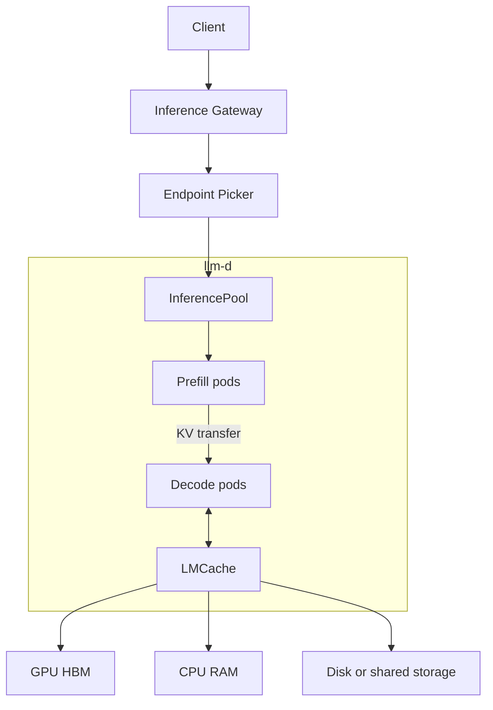

## TL;DR

Um Kubernetes `Service` distribui requests sem conhecer prefix-cache hits, uso do KV cache ou tamanho das filas. O llm-d adiciona routing ciente do estado da inferência, separa prefill de decode e permite offload hierárquico do KV cache. Ele orquestra engines como vLLM; não executa inferência por conta própria.

## Problema

Requests de LLM têm custos muito diferentes. Round-robin e least-connections não enxergam informações que determinam latência e uso de GPU:

- prompts podem compartilhar prefixos já presentes no cache de um pod;
- prefill consome principalmente compute, enquanto decode depende mais de bandwidth e memória;
- pressão do KV cache muda por pod e pode provocar eviction ou filas;
- uma conexão gerando muitos tokens pode ocupar recursos por vários segundos.

No exemplo do artigo, reutilizar um prefixo compartilhado de 4 mil tokens pode reduzir time to first token de cerca de 2 segundos para 40 milissegundos. Um load balancer comum perde essa localidade ao espalhar requests entre réplicas.

## Arquitetura

O llm-d usa componentes Kubernetes e uma engine de inferência existente:

- **vLLM:** executa o modelo e mantém o KV cache;
- **Gateway API Inference Extension:** fornece `InferencePool` e integração com routing de inferência;
- **Endpoint Picker (EPP):** pontua endpoints antes de cada request;
- **LeaderWorkerSet:** organiza réplicas de modelo distribuídas entre vários nodes;
- **LMCache:** move KV cache entre GPU, RAM e storage.



## Inference-aware routing

O EPP combina scorers para escolher o endpoint:

- `prefix-cache-scorer`: favorece pod que já possui maior parte do prefixo;
- `no-hit-lru-scorer`: distribui requests frias quando nenhum pod tem cache hit;
- `kv-cache-utilization-scorer`: penaliza pods próximos do limite de memória;
- `queue-scorer`: penaliza pods com fila profunda.

O objetivo não é somente equilibrar quantidade de conexões. Scheduler tenta maximizar reutilização do cache sem criar hotspots.

## Prefill e decode

Prefill processa prompt inteiro e tende a ser compute-bound. Decode gera tokens sequencialmente e tende a ser limitado por bandwidth e tamanho do KV cache.

O llm-d pode executar essas fases em pods separados. Prefill e decode escalam independentemente e podem usar tipos de GPU diferentes. O KV cache produzido no prefill é transferido ao decode por conectores como NIXL ou NCCL.

Essa separação faz sentido quando proporção entre tamanho do prompt e tamanho da resposta varia bastante. Para modelo pequeno, baixo QPS ou uma única réplica, custo operacional provavelmente supera benefício.

## KV cache hierárquico

LMCache permite retirar KV cache da memória HBM da GPU e mantê-lo em tiers mais baratos:

```text
GPU HBM -> CPU RAM -> disco ou storage compartilhado
```

Conversas longas podem retomar contexto sem recomputar todo prefixo depois de eviction da GPU. Ganho vem com mais componentes, transferências e pontos de falha.

## Demo sem GPU

Artigo demonstra control plane em cluster Kind usando `llm-d-inference-sim`, simulador compatível com API OpenAI. Flux entrega CRDs, router e quatro model servers simulados.

Teste observado:

- oito requests com mesmo prefixo foram direcionadas ao mesmo pod;
- oito prompts distintos foram distribuídos igualmente entre quatro pods.

Demo valida routing, scorer chain e topologia de disaggregation. Não mede tokens por segundo nem desempenho real de GPU.

## Limites

- Projeto estava em CNCF Sandbox; APIs e manifests ainda mudavam entre versões.
- Stack envolve Gateway API, GAIE, `InferencePool`, EPP, LeaderWorkerSet e LMCache.
- GPU Operator, node pools e scheduling continuam responsabilidade da plataforma.
- Ganho aparece principalmente em workloads multi-replica, multi-node e alto QPS.
- KServe não é substituto direto: `LLMInferenceService` usa fundamentos do llm-d e atua numa camada superior de lifecycle e governance.

## Quando considerar

Use llm-d quando prompts compartilham prefixos longos, prefill e decode têm perfis diferentes, modelo ocupa vários nodes ou custo de GPU justifica routing especializado.

Para modelo pequeno e baixo QPS, vLLM atrás de um `Service` costuma bastar. Para scheduling e fair-share de GPUs, problema pertence primeiro a ferramentas como Kueue ou Volcano.

## Fonte

[llm-d - Kubernetes-Native Distributed LLM Inference at Scale](https://srekubecraft.io/posts/llm-d-distributed-inference/) - Nick Nikolakakis, SREKubeCraft

## Connections

- [[Cursos/Descomplicando System Design/Concepts/Kubernetes|Kubernetes]]
- [[Cursos/Descomplicando System Design/Load Balancing/Load Balancing (Balanceamento de Carga)|Load Balancing]]
- [[Cursos/Descomplicando System Design/Escalabilidade, Performance e Capacidade/Performance|Performance]]
